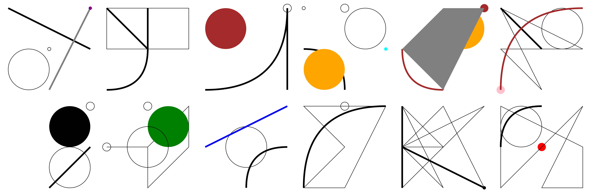

# Shapemaker

:: en

I wanted to dabble in generative art, and, as a first project, create a way to generate small, icon-like shapes from a predefined set of possible lines, curves and circles

## Reducing the set of possibilities to tame randomness' chaos

When letting randomness control decisions in a creative process, it is important to restrict the set of possibilities, as utter chaos ensues without constraints. It's then a question of finding the right amount of possibilities, as there's a tradeoff of guaranteed minimum aesthetics versus lack of interesting generations.

I decided on three constraints:

- A fixed set of possible shapes: outward and inward quadratic bézier curves, three sizes of circles, lines, and polygons (with a limit on the number of segments forming the polygon)
- A fixed set of possible positions of these shapes: they tart and end on fixed "anchor points": south-west, south, south-east, east, north-east, north, north-west, west and center (I then generalized this to any point of a controllable grid size, which was also useful to control the aspect ratio of the final image)
- A fixed set of colors: I re-used the idea of limiting colors to a code editor theme's palette from [Abstract wallpapers per color scheme](/abstract-wallpapers-per-color-scheme), this time with black, white, red, green, blue, yellow, orange, purple, brown, cyan, pink, and gray.

The idea was to then generate SVG from randomly-selected objects that fit these constraints.

## Music videos

I then got the idea to link evolution of these shapes to a music, and decided to write logic to render videos by hooking into key moments of a song: time markers, set in the music creation software, new beats (to sync something to the beat), change of individual instruments' volume (to sync something to e.g. the bass' notes), etc.

I first struggled to keep frames in sync with the beat, but finally managed to by iterating over the number of milliseconds instead of the number of frames when generating the video's frames.

As the shape generator outputs SVGs, the frames are converted to PNGs with _ImageMagick_, then concatenated with the audio into a video using _ffmpeg_.

[Source code](https://github.com/ewen-lbh/shapemaker)

:: fr

Je voulais m'essayer à l'art génératif, et, comme premier projet, créer un moyen de générer de petites formes en icône à partir d'un ensemble prédéfini de lignes, courbes et cercles possibles

## Réduire l'ensemble des possibilités pour dompter le chaos du hasard

Lorsqu'on laisse le hasard contrôler les décisions dans un processus créatif, il est important de restreindre l'ensemble des possibilités, car un chaos total s'ensuit sans contraintes. C'est alors une question de trouver le bon nombre de possibilités, car il y a un compromis entre un minimum esthétique garanti et un manque de générations intéressantes.

J'ai décidé de trois contraintes:

- Un ensemble fixe de formes possibles: courbes de Bézier quadratiques vers l'extérieur et vers l'intérieur, trois tailles de cercles, lignes et polygones (avec une limite sur le nombre de segments formant le polygone)
- Un ensemble fixe de positions possibles pour ces formes: elles commencent et se terminent sur des "points d'ancrage" fixes: sud-ouest, sud, sud-est, est, nord-est, nord, nord-ouest, ouest et centre (j'ai ensuite généralisé cela à n'importe quel point d'une grille contrôlable, ce qui était également utile pour contrôler le rapport hauteur/largeur de l'image finale)
- Un ensemble fixe de couleurs: j'ai réutilisé l'idée de limiter les couleurs à une palette de thème d'éditeur de code de [Abstract wallpapers per color scheme](/abstract-wallpapers-per-color-scheme), cette fois avec du noir, du blanc, du rouge, du vert, du bleu, du jaune, de l'orange, du violet, du marron, du cyan, du rose et du gris.

L'idée était ensuite de générer des SVG à partir d'objets sélectionnés au hasard qui respectent ces contraintes.

## Clips musicaux

J'ai ensuite eu l'idée de lier l'évolution de ces formes à une musique, et j'ai décidé d'écrire une logique pour rendre des vidéos en se connectant à des moments clés d'une chanson: marqueurs de temps, définis dans le logiciel de création musicale, nouveaux beats (pour synchroniser quelque chose avec le beat), changement du volume des instruments individuels (pour synchroniser quelque chose avec par exemple les notes de la basse), etc.

J'ai d'abord eu du mal à garder les images en synchronisation avec le beat, mais j'ai finalement réussi en itérant sur le nombre de millisecondes au lieu du nombre d'images lors de la génération des images de la vidéo.

Comme le générateur de formes produit des SVG, les images sont converties en PNG avec _ImageMagick_, puis concaténées avec l'audio en une vidéo à l'aide de _ffmpeg_.

[Code source](https://github.com/ewen-lbh/shapemaker)
