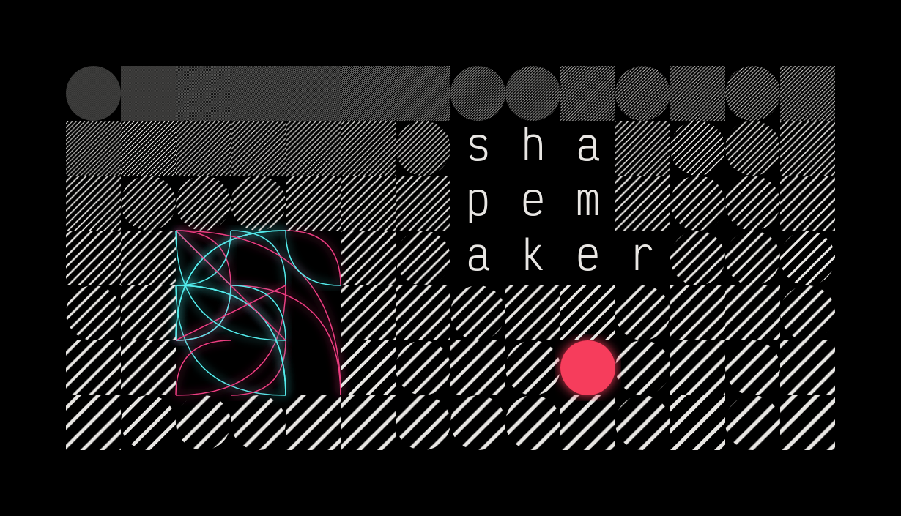

---
tags:
- graphism
- programming
- experiment
- language
- command line
made with:
- svg
- rust
---

# Shapemaker

:: en

I wanted to dabble in generative art, and, as a first project, create a way to generate small, icon-like shapes from a predefined set of possible lines, curves and circles

## Reducing the set of possibilities to tame randomness' chaos

When letting randomness control decisions in a creative process, it is important to restrict the set of possibilities, as utter chaos ensues without constraints. It's then a question of finding the right amount of possibilities, as there's a tradeoff of guaranteed minimum aesthetics versus lack of interesting generations.

I decided on three constraints:

- A fixed set of possible shapes: outward and inward quadratic bézier curves, three sizes of circles, lines, and polygons (with a limit on the number of segments forming the polygon)
- A fixed set of possible positions of these shapes: they tart and end on fixed "anchor points": south-west, south, south-east, east, north-east, north, north-west, west and center (I then generalized this to any point of a controllable grid size, which was also useful to control the aspect ratio of the final image)
- A fixed set of colors: I re-used the idea of limiting colors to a code editor theme's palette from [Abstract wallpapers per color scheme](/abstract-wallpapers-per-color-scheme), this time with black, white, red, green, blue, yellow, orange, purple, brown, cyan, pink, and gray.

The idea was to then generate SVG from randomly-selected objects that fit these constraints.

## Music videos

I then got the idea to link evolution of these shapes to a music, and decided to write logic to render videos by hooking into key moments of a song: time markers, set in the music creation software, new beats (to sync something to the beat), change of individual instruments' volume (to sync something to e.g. the bass' notes), etc.

I first struggled to keep frames in sync with the beat, but finally managed to by iterating over the number of milliseconds instead of the number of frames when generating the video's frames.

As the shape generator outputs SVGs, the frames are converted to PNGs with _ImageMagick_, then concatenated with the audio into a video using _ffmpeg_.
