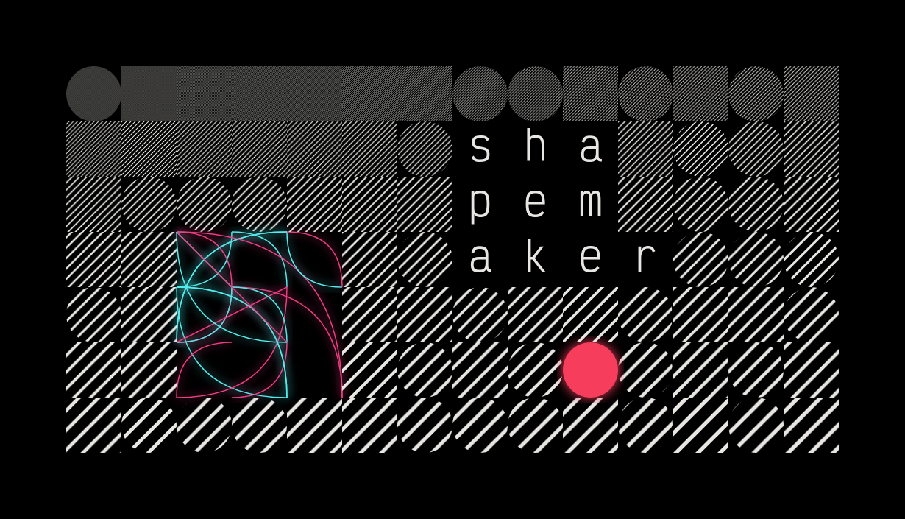
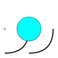
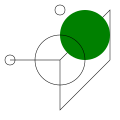
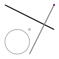
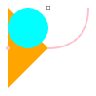
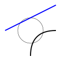

    <em><a href="https://github.com/ewen-lbh/shapemaker/blob/e7ff660d42f4fc3cb29e1246ee82cbdd2f27c5ab/src/examples.rs#L114">See the code that generated this image</a></em>

* * *

> **⚠️ Warning:**
> README is still a work-in-progress

An experiment into the generation of 2D flat design abstract artwork using limited shape and color combinations, arranged in a 8-point grid.

  

## Gallery

**HAL 9000**

**Amogus**

**Capitalism**

**Cutting An Egg**

**Designing A Font**

**Drone Operating System**

**Iron Factory**

**Japan Sledding Olympics**

**Lunatic Green Energy**

**Measuring Spirits**

**Phone Cameras**

**Reflections**

**Spline Optimisation**

**Tropical Fish**

**Weaving**

